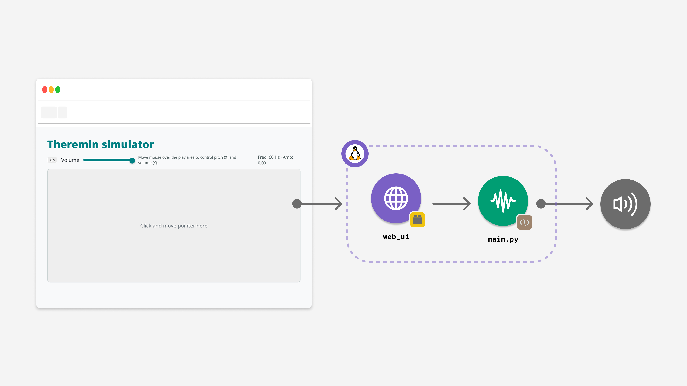
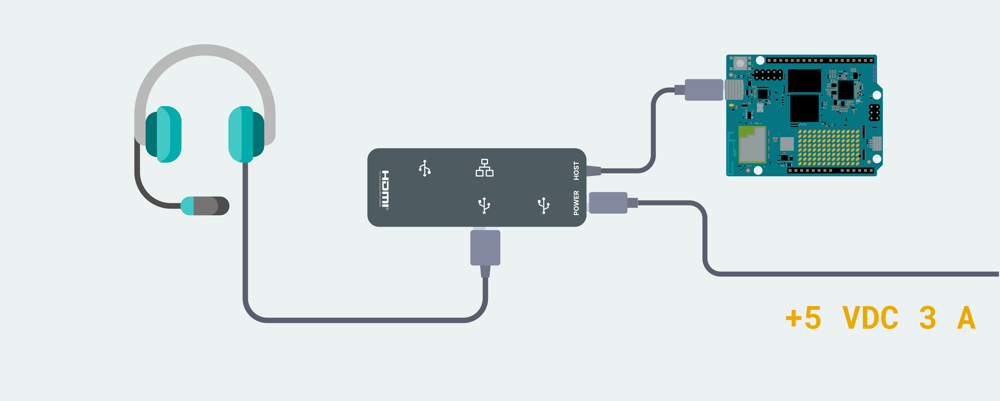
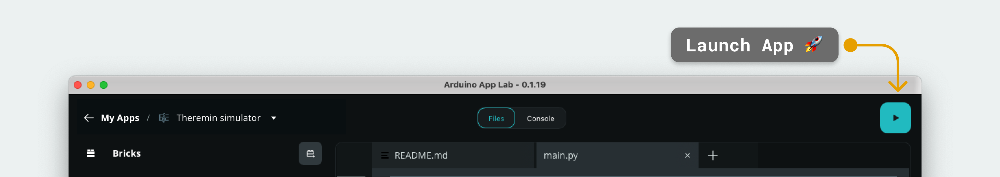

# Theremin Simulator

The **Theremin Simulator** example lets you create and control a virtual theremin instrument using an interactive web interface, producing synthesized audio output through a connected **USB** audio device with minimal latency.

> **Note**: This example must be run in **[Network Mode](learn/network-mode)** or **[SBC Mode](learn/single-board-computer)**, since it requires a **USB-C® hub** and a **USB speaker**.



This example generates real-time audio by creating sine waves at varying frequencies and amplitudes based on user input from the web interface. The workflow involves receiving mouse/touch coordinates from the frontend, calculating the corresponding frequency and amplitude, generating audio blocks using a sine wave generator, and playing them through a **USB** audio device with minimal latency.


## Bricks Used

- `web_ui`: Brick that provides the web interface and a WebSocket channel for real-time control of the theremin.


## Hardware and Software Requirements

### Hardware

- [Arduino UNO Q](https://store.arduino.cc/products/uno-q) (x1)
- **USB-C® hub with external power (x1)**
- A power supply (5 V, 3 A) for the USB hub adapter with external power (x1)
- A **USB audio device** (choose one):
  - **USB speaker** (cabled) (x1) ✅ *supported*
  - **USB wireless speaker receiver/dongle** (2.4 GHz) (x1) ✅ *supported*
  - **USB‑C → 3.5 mm audio connector** + headphones/speakers (x1) ⚠️ *not tested* (may work)
- A **power supply** (5 V, 3 A) for the USB hub (e.g. a phone charger)

> **Not supported:** **HDMI audio and Bluetooth® Speakers** output is not supported by this App.

### Software

- Arduino App Lab

**Note:** A **USB-C® hub is mandatory** for this example. The UNO Q's single port must be used for the hub, which provides the necessary connections for both the power supply and the USB audio device. Consequently, this example must be run in **[Network Mode](learn/network-mode)** or **[SBC Mode](learn/single-board-computer)**.


## How to Use the Example

1. Connect your **USB audio device** (e.g., USB speaker, wireless USB receiver, or USB‑C→3.5 mm dongle) to a powered **USB-C® hub** attached to the UNO Q.
   

2. Launch the App by clicking the **Play** button in the top-right corner. Wait until the App has launched. 
   
3. Open the App in your browser at `<UNO-Q-IP-ADDRESS>:7000` *(typically 192.168.x.x, e.g., http://192.168.1.11:7000)*.
4. Click and drag your mouse (or use touch) on the interactive area to play:
   - **Horizontal movement (X-axis)** controls the **pitch** (frequency).
   - **Vertical movement (Y-axis)** controls the **volume** (amplitude).


## How it Works

The application creates a real-time audio synthesizer controlled by a web interface. User interactions on the webpage are sent to the Python backend via a WebSocket. The backend then calculates the audio parameters, generates a sine wave, and streams the audio data directly to the connected **USB** audio device.

- **User Interaction**: The frontend captures mouse or touch coordinates within a designated "play area".
- **Real-time Communication**: These coordinates are sent to the Python backend in real-time using the `web_ui` Brick's WebSocket channel.
- **Audio Synthesis**: The backend maps the X-coordinate to **frequency** and the Y-coordinate to **amplitude**. It uses a sine wave generator to create small blocks of audio data based on these parameters.
- **Audio Output**: The generated audio blocks are continuously streamed to the **USB** audio device, creating a smooth and responsive sound.

High-level data flow:
```
Web Browser Interaction → WebSocket → Python Backend → Sine Wave Generation → USB Audio Device Output
```


## Understanding the Code

### 🔧 Backend (`main.py`)

The Python code manages the web server, handles real-time user input, and performs all audio generation and playback.

- `ui = WebUI()` – Initializes the web server that serves the HTML interface and handles WebSocket communication.
- `speaker = Speaker(...)` – Initializes the connection to the USB audio device. This will raise an error if no compatible device is found.
- `sine_gen = SineGenerator(...)` – Creates an instance of the audio synthesis engine.
- `ui.on_message('theremin:move', on_move)` – Registers a handler that fires whenever the frontend sends new coordinates. This function updates the target frequency and amplitude.
- `theremin_producer_loop()` – Core audio engine. Runs continuously, generating ~**30 ms** blocks of audio based on the current frequency and amplitude, and streams them to the audio device for playback. This non-blocking, continuous stream ensures smooth audio without cracks or pops.

### 💻 Frontend (`main.js`)

The web interface provides the interactive play area and controls for the user.

- **Socket.IO connection** to the backend to send and receive data in real time.
- **Event listeners** capture `mousedown`, `mousemove`, `mouseup` (and touch equivalents) to track user interaction in the play area.
- `socket.emit('theremin:move', { x, y })` – Sends normalized (0.0–1.0) X and Y coordinates to the backend; emissions are **throttled to ~80 Hz (≈12 ms)** to avoid overload.
- `socket.on('theremin:state', ...)` – Receives state updates from the backend (like the calculated frequency and amplitude) and updates the values displayed on the webpage.
- `socket.emit('theremin:set_volume', { volume })` – Sends a **0.0–1.0** master volume value and updates a progress bar in the UI.
- `socket.emit('theremin:power', { on })` – Toggles synth power (**On/Off**). After turning **On**, move/tap in the play area to resume sound.


## Troubleshooting

### "No USB speaker found" error

If the application fails to start and you see the following error in the logs, it means the required audio hardware is missing or not detected.
```
arduino.app_peripherals.speaker.SpeakerException: No USB speaker found.
```
**Fix:**  
1. Make sure a **powered USB-C® hub** is connected to the UNO Q and its **5 V / 3 A** power supply is plugged in.  
2. Verify the **USB audio device** (USB speaker, wireless USB receiver, or USB-C→3.5 mm dongle) is **connected to the hub** and, if it has a switch, **turned on**.  
3. Restart the application.

### No Sound Output

- **Power Button:** Make sure the button in the web UI shows **On**.  
- **Volume Slider:** Increase the volume slider in the web UI.  
- **Pointer Position:** Move your mouse/finger toward the top of the play area (the bottom corresponds to zero volume).  
- **Speaker/Headphone Volume:** Check the physical volume control and mute status on your speaker or headphones.  
- **Output Path:** Remember that **HDMI audio** and **Bluetooth® speakers** are not supported; use a **USB** audio device.

### Choppy or Crackling Audio

- **CPU Load:** Close any other applications running on the Arduino UNO Q that may be consuming significant resources.  
- **Power Supply:** Ensure you are using a stable, adequate power supply (5 V, 3 A) for the USB-C® hub, as insufficient power can affect USB peripheral performance.


## Technical Details

- **Sample rate:** 16,000 Hz  
- **Audio format:** 32-bit float, little-endian  
- **Block duration:** ~30 ms (≈480 samples per block)  
- **Frequency range:** ~20 Hz to ~8,000 Hz  
- **Update rate:** Frontend throttled to ~80 Hz (≈12 ms minimum between updates)


## Compatibility Notes

- **Works with:**  
  - **USB speakers** (cabled)  
  - **USB wireless speaker receivers** (2.4 GHz dongles)
- **Untested (may work):**  
  - **USB‑C → 3.5 mm audio dongles** feeding analog speakers/headphones
- **Not supported:**  
  - **HDMI audio** output  
  - **Bluetooth® speakers**


## License

This example is licensed under the Mozilla Public License 2.0 (MPL-2.0).

Copyright (C) 2025 ARDUINO SA <http://www.arduino.cc>